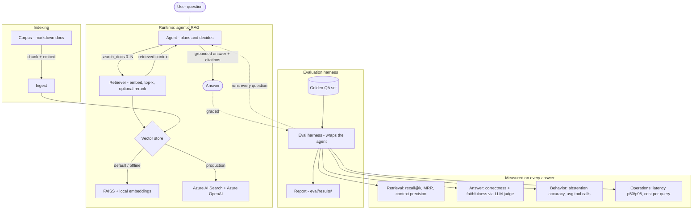

# Practical-Agents

An **agentic RAG** system built **eval-first**: a tool-using LLM agent answers
questions over a technical documentation corpus, and every answer is scored for
**retrieval quality, correctness, faithfulness, cost, and latency**. The point of
this project is not that an agent can answer questions — it's that you can *prove
how well it does*, find where it breaks, and make principled tradeoffs.

> Most portfolio "agent" projects ship a demo and stop. This one ships the
> measurement: a reproducible evaluation harness with an LLM-as-judge, retrieval
> metrics, and ablation studies. The harness is the product.

## TL;DR

```bash
make setup      # create venv, install deps
make ingest     # chunk + embed the corpus into a vector index
make demo       # ask the agent a question interactively
make eval       # run the full evaluation harness -> eval/results/
```

`make eval` runs with **zero API keys** using a local embedding + FAISS backend,
so anyone can reproduce the numbers. Point it at **Azure OpenAI + Azure AI
Search** with a `.env` file to run the production path (see
[Configuration](#configuration)).

### Run it without `make` (Windows / any OS)

`make` is a convenience for Unix/CI. On any platform, from the project root:

```bash
pip install -r requirements.txt          # numpy is the only hard requirement
python -m src.practical_agents.ingest     # build the index
python -m eval.run_eval                    # -> eval/results/report.md
python -m eval.run_eval --ablate           # -> eval/results/ablation.md
python scripts/demo.py "How many retries by default?"
```

> Optional extras (`sentence-transformers`, `faiss-cpu`) are auto-detected and
> improve retrieval; without them the pipeline still runs on a built-in hashed
> embedding + NumPy search. If you have an `OPENAI_API_KEY`/Azure keys set in
> your shell, they take priority — unset them to force the reproducible local
> path.

## Why this design

| Decision | Rationale |
| --- | --- |
| **Eval-first** | The scarce skill in applied ML isn't building an agent — it's knowing whether it's good. The harness (`eval/`) is the core deliverable. |
| **Azure-first, provider-agnostic** | Runs on Azure OpenAI + Azure AI Search in production, but falls back to local FAISS + `sentence-transformers` so results are reproducible offline. |
| **Closed-world synthetic corpus** | The docs describe a fictional library ("Meridian"). Because the world is closed, every question has an *unambiguous* ground truth, which makes faithfulness/groundedness measurable rather than a judgment call. Swap in real docs by pointing `CORPUS_DIR` at any folder of `.md` files. |
| **Agent, not just a pipeline** | The model decides *whether* and *how many times* to search, and can say "not in the docs." That decision quality is itself evaluated (see over/under-retrieval metrics). |

## Architecture

The agent decides *whether* and *how often* to search, retrieves from a swappable
vector store, and answers only from what it found. An evaluation harness wraps the
whole thing and scores every answer. (Diagram source: [`docs/architecture.mmd`](docs/architecture.mmd).)



## Evaluation

The harness scores four families of metrics on a golden set (`eval/golden.jsonl`):

1. **Retrieval** — did we fetch the right chunks?
   `recall@k`, `MRR`, `context precision`.
2. **Answer quality** — an LLM-judge grades each answer against the reference for
   `correctness` and against the *retrieved context* for `faithfulness`
   (did the answer invent anything not in the retrieved text?).
3. **Behavior** — for questions whose answer is deliberately *not* in the corpus,
   does the agent correctly **abstain** instead of hallucinating?
   (`abstention precision/recall`.)
4. **Operations** — `latency p50/p95` and estimated `$/query`.

### Results (real LLM run)

Measured on the 23-question golden set with a real LLM in the loop
(**GPT-OSS-20B** for generation *and* the judge, MiniLM embeddings, FAISS). The
model both answers and grades; retrieval is local.

| Metric | Value | Reading |
| --- | --- | --- |
| correctness | **0.870** | 20/23 answers match the reference |
| faithfulness | **1.000** | zero hallucinations — every claim is grounded in retrieved text |
| recall@5 | **0.895** | retrieval finds the relevant doc ~90% of the time |
| MRR | **0.816** | the relevant doc is usually rank 1 |
| abstention recall | **1.000** | caught **every** out-of-scope question instead of bluffing |
| abstention precision | 0.667 | 2 false abstentions, both from retrieval misses (below) |
| avg tool calls | 1.30 | the agent searches ~once, sometimes twice |

**The failures are honest and traceable.** The only 3 correctness misses:
- **q04 (worker concurrency)** and **q05 (priority order)** — retrieval didn't
  surface `quickstart.md` (recall@5 = 0 on both), so the agent correctly
  *abstained* rather than guess. Those are **retrieval** misses, not generation
  misses — and the ablation below shows they disappear with a better retrieval
  config. This is also why abstention precision is 0.667: the 2 "false"
  abstentions are the agent being honest about missing context, not hallucinating.
- **q22** — a judge-strictness quibble on an out-of-scope question the agent
  correctly declined.

> **Latency is intentionally omitted from the headline.** The run used Groq's
> free tier, whose token-per-minute limit forces the client to sleep between
> calls, so measured latency (p50 ~15 s) reflects rate-limit backoff, not model
> speed — single calls run ~2 s. On a paid tier the reported latency is real.

**Zero-key reproduction.** With no API keys set, the same `python -m eval.run_eval`
runs fully offline (local embeddings + an extractive answerer). Retrieval and
faithfulness match; correctness is lower because the offline stub can't reason
about absent/negated facts — that gap is exactly what the real-LLM run above
closes, with the harness unchanged.

### Ablations (`make ablate`)

Retrieval-only sweep (fast, offline, no LLM needed since these knobs only affect
retrieval). It isolates the two `quickstart.md` misses from the headline run:

| Config | recall@k | faithfulness |
| --- | --- | --- |
| k=3, no rerank, chunk=220 | 0.895 | 1.000 |
| k=5, no rerank, chunk=220 (headline default) | 0.895 | 1.000 |
| k=5, **+ rerank**, chunk=220 | **1.000** | 1.000 |
| k=5, no rerank, **chunk=120** | **1.000** | 1.000 |

**Takeaway:** both a cross-encoder reranker *and* simply halving the chunk size
recover the last ~10% of recall (the q04/q05 misses) — but on this corpus the
chunk-size change does it at a fraction of the reranker's latency. That is the
kind of cost/quality tradeoff the harness exists to surface. Numbers regenerate
into `eval/results/`.

## Configuration

Copy `.env.example` to `.env`. With **no** variables set, the project runs the
local backend. The provider layer (`src/practical_agents/config.py`) auto-selects
a backend at runtime, so the same code path is exercised everywhere.

**Azure OpenAI** (production target — Azure OpenAI + optional Azure AI Search):

```dotenv
AZURE_OPENAI_ENDPOINT=https://<resource>.openai.azure.com
AZURE_OPENAI_API_KEY=<key>
AZURE_OPENAI_CHAT_DEPLOYMENT=gpt-4o-mini
AZURE_OPENAI_EMBED_DEPLOYMENT=text-embedding-3-small
# Optional Azure AI Search vector store; else local FAISS:
AZURE_SEARCH_ENDPOINT=https://<resource>.search.windows.net
AZURE_SEARCH_API_KEY=<key>
AZURE_SEARCH_INDEX=practical-agents
```

**Any OpenAI-compatible endpoint** (e.g. Groq, used for the headline run above —
free tier, no card). Groq serves chat only, so embeddings fall back to the local
MiniLM model automatically:

```dotenv
GROQ_API_KEY=<key>
GROQ_CHAT_MODEL=openai/gpt-oss-20b   # optional; this is the default-ish pick
```

Plain `OPENAI_API_KEY` works too. Retrieval knobs (`TOP_K`, `USE_RERANKER`,
`CHUNK_TOKENS`) are also env-overridable — see `.env.example`.

## Project layout

```
corpus/                     closed-world synthetic docs (the knowledge base)
src/practical_agents/
  config.py                 provider/config resolution (Azure-first, local fallback)
  llm.py                    chat + judge client (Azure OpenAI / OpenAI / local)
  embeddings.py             embedding client (Azure / OpenAI / sentence-transformers / hashing)
  vectorstore.py            FAISS (local) and Azure AI Search backends
  ingest.py                 chunk → embed → index
  retriever.py              top-k retrieval (+ optional cross-encoder rerank)
  tools.py                  the search_docs tool the agent calls
  agent.py                  the tool-using agent loop
eval/
  golden.jsonl              questions with reference answers + relevant doc ids
  metrics.py                retrieval + behavior metrics (pure functions, tested)
  judge.py                  LLM-as-judge for correctness + faithfulness
  run_eval.py               runs the harness → eval/results/report.md
scripts/demo.py             interactive CLI
tests/                      unit tests for metrics + chunking
```

## Roadmap / what I'd do next

- Add a **hard-negative** retrieval test set to stress the reranker.
- Swap the synthetic corpus for a real one (Azure SDK docs) and re-baseline.
- Add **online eval**: sample live queries and score them nightly.
- Trace every run with token-level cost attribution per tool call.

## License

MIT
